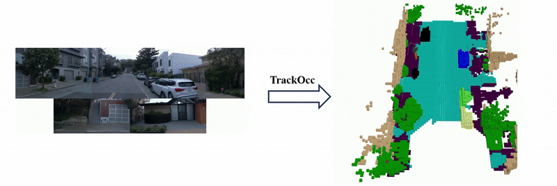

<div align="center">

<h1>TrackOcc: Camera-based 4D Panoptic Occupancy Tracking</h1>

[Zhuoguang Chen*](https://zgchen33.github.io/), [Kenan Li*](https://connorkevin.github.io/), [Xiuyu Yang](https://www.linkedin.com/in/xiuyu-yang-48765a206/), [Tao Jiang](https://github.com/Tsinghua-MARS-Lab/TrackOcc), [Yiming Li](https://roboticsyimingli.github.io/), [Hang Zhao†](https://hangzhaomit.github.io/)

*: equal contribution, †: corresponding author

**ICRA 2025**

<a href="https://arxiv.org/abs/2503.08471"></a>
<a href="https://www.youtube.com/watch?v=BjksLN92P14"></a>
<a href='https://huggingface.co/datasets/zgchen33/TrackOcc_waymo/'></a>



Same color = same instance, across 3D space and time.

</div>

## 🚀 News
- [2025/04]: We release the source code!
- [2025/03]: The preprint version is available on [arXiv](https://arxiv.org/abs/2503.08471).
- [2025/01]: Our work is accepted by **2025 IEEE International Conference on Robotics and Automation**.

## 📝 Overview
### 💡 **New Task and Benchmark**

To the best of our knowledge, we make the first attempt to explore a camera-based 4D panoptic occupancy tracking task, which jointly tackles occupancy panoptic segmentation and object tracking with camera input.
For fair evaluations, we propose the OccSTQ metric and build a set of baselines adapted from other domains. 

### ✨ **New model**

We propose TrackOcc, which uses 4D panoptic queries to perform the proposed task in a streaming, end-to-end manner. We also introduce a localization-aware loss to enhance the tracking performance.


## 🔧 Get Started

### Installation and Data Preparation

#### Step 1. Installation 

Clone TrackOcc
```
git clone https://github.com/Tsinghua-MARS-Lab/TrackOcc.git
cd TrackOcc
```

Create conda environment
```
conda create -n trackocc python=3.8
conda activate trackocc
# PyTorch 1.12.1 + CUDA 11.3
conda install pytorch==1.12.1 torchvision==0.13.1 torchaudio==0.12.1 cudatoolkit=11.3 -c pytorch
```

Install other dependencies

```
pip install openmim
mim install mmcv-full==1.6.0
mim install mmdet==2.28.2
mim install mmsegmentation==0.30.0
mim install mmdet3d==1.0.0rc6
pip install setuptools==59.5.0
pip install numpy==1.23.5
pip install yapf==0.40.1
```

Compile CUDA extensions
```
pip install -v -e . 
```
#### Step 2. Data Preparation 

TrackOcc's data (including 5-frame interval sampled images) and labels are now available on [Hugging Face](https://huggingface.co/datasets/zgchen33/TrackOcc_waymo/). Prepare the `data` folder to the following structure:

```
data/TrackOcc-waymo
├── kitti_format
    ├── waymo_infos_train_jpg.pkl
    ├── waymo_infos_val_jpg.pkl
    ├── training
        ├── image_0
        ├── ......
        └── image_4
└── pano_voxel04
    ├── trainig
    │   ├── 000
            ├── 000_04.npz
            ├── 001_04.npz
            └── ......
    │   ├── 001
    │   └── ......
    └── validation

```
### Training
The backbone is pretrained on [nuImages](https://download.openmmlab.com/mmdetection3d/v0.1.0_models/nuimages_semseg/cascade_mask_rcnn_r50_fpn_coco-20e_20e_nuim/cascade_mask_rcnn_r50_fpn_coco-20e_20e_nuim_20201009_124951-40963960.pth). Download the weight to `pretrain/xxx.pth` before you start training. Remember that you need to modify some params of the config file.  

```
./dist_train.sh configs/TrackOcc/trackocc_r50_704x256_3inst_3f_8gpu.py 8
```

#### Using Slurm:
Remenber that you need to modify some params in the command.
```
GPUS=8 ./slurm_train.sh PARTITION JOB_NAME configs/TrackOcc/trackocc_r50_704x256_3inst_3f_8gpu.py --cfg-options 'dist_params.port=29500'
```

### Evaluation
Our trained weight is released at [Hugging Face](https://huggingface.co/zgchen33/TrackOcc/blob/main/trackocc_r50_704x256_3inst_3f_8gpu.pth). Download the weight to `pretrain/xxx.pth` before you start evaluating.

```
./dist_test.sh configs/TrackOcc/trackocc_r50_704x256_3inst_3f_8gpu.py pretrain/trackocc_r50_704x256_3inst_3f_8gpu.pth 8
```
#### Using slurm:
```
GPUS=8 ./slurm_test.sh PARTITION JOB_NAME configs/TrackOcc/trackocc_r50_704x256_3inst_3f_8gpu.py pretrain/trackocc_r50_704x256_3inst_3f_8gpu.pth --cfg-options 'dist_params.port=28506'
```

### Timing
```
CUDA_VISIBLE_DEVICES=0 python timing_trackocc.py configs/TrackOcc/trackocc_r50_704x256_3inst_3f_8gpu.py pretrain/trackocc_r50_704x256_3inst_3f_8gpu.pth
```

## 🙏 Acknowledgement

This project is not possible without multiple great open-sourced code bases. We list some notable examples below.

* [MaskFormer](https://github.com/facebookresearch/MaskFormer)
* [SparseOcc](https://github.com/MCG-NJU/SparseOcc/)
* [FB-OCC](https://github.com/NVlabs/FB-BEV)
* [COTR](https://github.com/NotACracker/COTR)
* [4D-PLS](https://github.com/mehmetaygun/4d-pls)
* [MMDetection3D](https://github.com/open-mmlab/mmdetection3d)

## 📃 Bibtex

If this work is helpful for your research, please consider citing the following BibTeX entry.

```
@article{chen2025trackocc,
    title={TrackOcc: Camera-based 4D Panoptic Occupancy Tracking}, 
    author={Zhuoguang Chen and Kenan Li and Xiuyu Yang and Tao Jiang and Yiming Li and Hang Zhao},
    journal={arXiv preprint arXiv:2503.08471},
    year={2025}
}
```